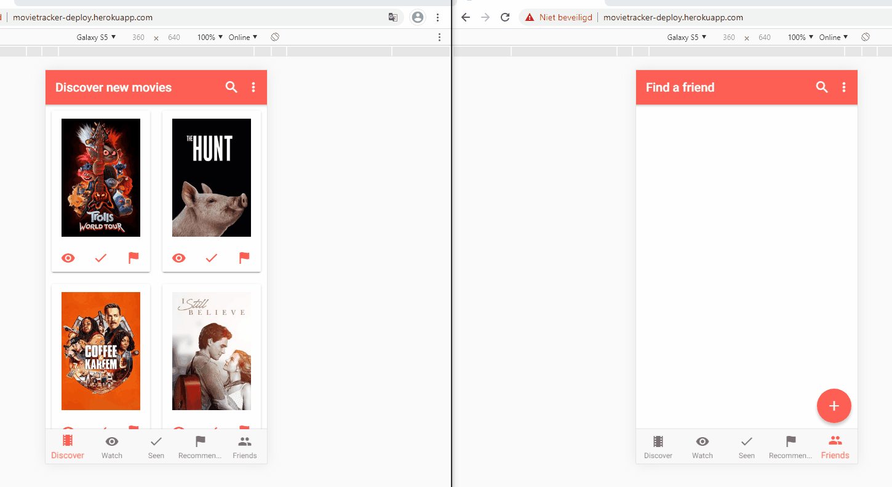

# MovieApp-ionicv3-PWA

## Description
This is a progressive web application built with Ionic v3. With this application you can keep track of movies you have seen and which movies you would like to see. Friends can be added and movie recommendations can be sent to them. 
It uses service workers and CouchDB ([PouchDB](https://pouchdb.com/)) to keep a local database of movies that syncs with a remote database.
A cache is used to cache requests when the network disconnects. Users can use every function of the application offline with the exception of new movie searches. 
Images are also cached and reused.

## Features
* cached movie lookup requests
* images are cached locally and reused
* database synchronises locally to a remote database (useable offline)
* invite based friend system
* single page application
* real time data base changes (friends and recommended movies are shown without refreshing/navigating)
* layout changes depending on detected platform (android vs desktop)
* lazy loading images
* infinite scrolling with a new request (next page) on scroll end

## Installation
The "add application to starter screen" can be used or a converted android application can be downloaded directly (link only shown on mobile). 

## Hosting
The app is hosted on [heroku](https://movietracker-deploy.herokuapp.com) with a separate node server responsible for registering users.
Cloudant is used to host the CouchDB database.

### demo

#### desktop view

#### add friends

#### recommend movies

#### offline requests

